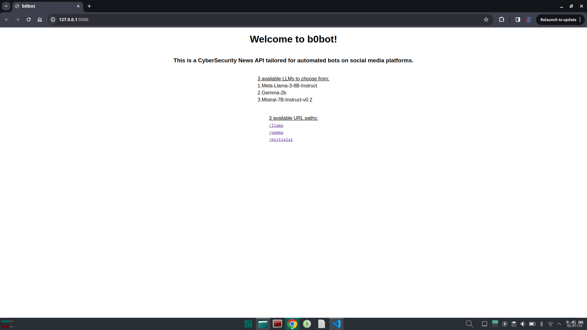
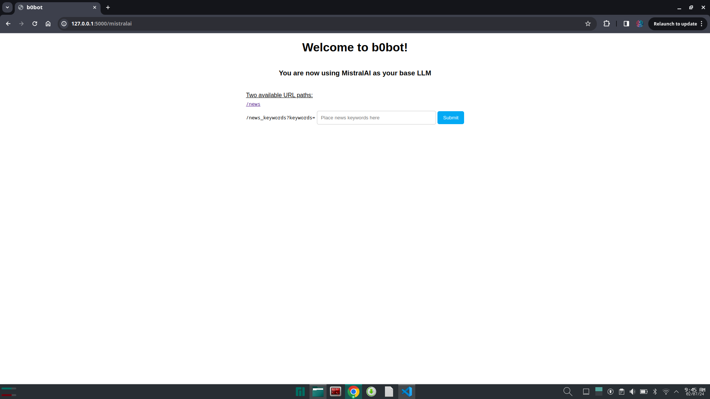
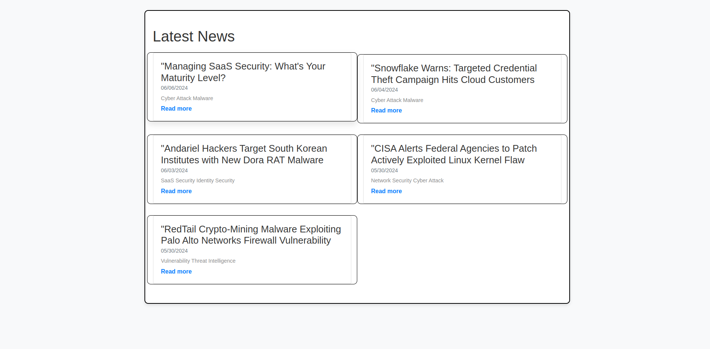
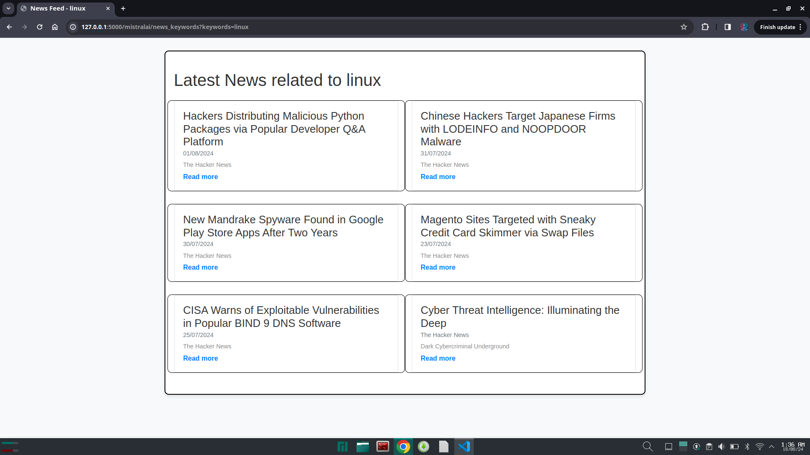
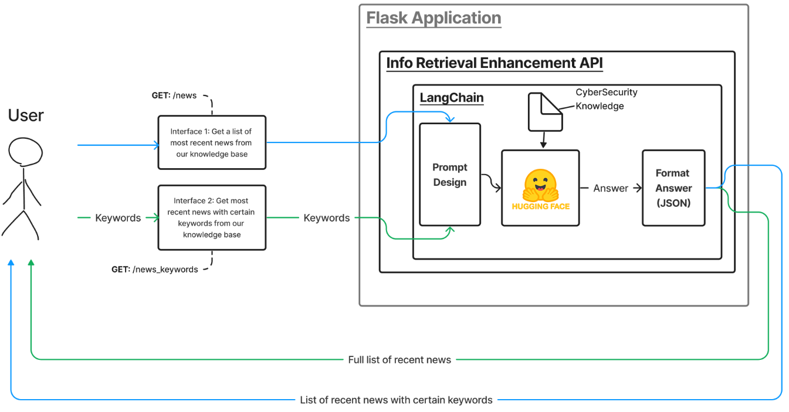
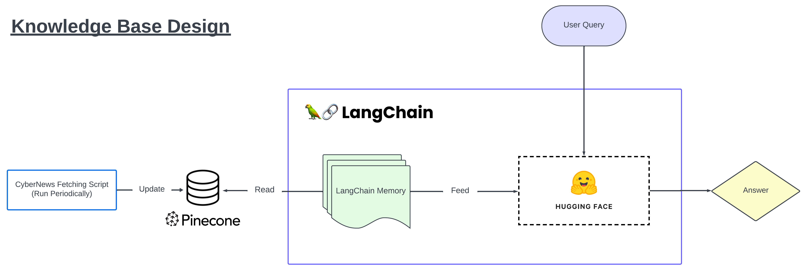

<h1 align="center">B0Bot - CyberSecurity News API</h1>
<p align="center">
  <br/><br/>
  <a href="https://github.com/c2siorg/b0bot"></a>
  <a href="https://github.com/c2siorg/b0bot"></a>
  <a target="_blank" href="https://github.com/c2siorg/b0bot"></a>
  <a href="https://github.com/hywax/mafl/blob/main/LICENSE"></a>
  <br/><br/>
</p>
<p>
B0Bot is a CyberSecurity News API tailored for automated bots and applications that need quick access to the latest cybersecurity information.

The API enables developers to retrieve cybersecurity news articles using either specific keywords or general queries. It is designed to integrate easily with social media bots, automation pipelines, and monitoring systems.

The system combines modern AI and retrieval technologies including:

Flask for the backend API

LangChain for orchestration

HuggingFace LLM endpoints

Pinecone vector database

MongoDB Atlas knowledge base

When a user sends a request, B0Bot retrieves relevant cybersecurity news from its knowledge base, processes it through an LLM, and returns a structured JSON response containing the requested information.
</p>


## App Screenshots

| Home Page | LLM Page | News Page | News Keywords Page |
| :--------:| :-------:| :--------:| :-----------------:|
|  |  |  |  |

## Tech Stack

**Backend**
- Flask

**AI / LLM**
- LangChain
- HuggingFace Models (Llama, Gemma, Mistral)

**Vector Database**
- Pinecone

**Database**
- MongoDB Atlas

**Deployment**
- Render (Serverless API)

**Monitoring**
- Better Uptime

## Setup
1. Install Dependencies

Install all required Python packages:

pip install -r ./requirements.txt

2. Set Up Pinecone Database

Create an account:

https://www.pinecone.io/

Create a new index named:

news-index

Then add your Pinecone API key in the .env file.

3. Set Up HuggingFace

Create an account:

https://huggingface.co/

Generate an access token.

4. Configure Environment Variables

Add the following values in your .env file:
# HuggingFace
HUGGINGFACE_TOKEN=your_huggingface_token

# Pinecone
PINECONE_API_KEY=your_pinecone_api_key


5. Configure Pinecone Connection

Update the connection string in the project code:

client = Pinecone(api_key={PINECONE_API})

Replace it with your own API key.

6. Update the Knowledge Base

Run the update worker to scrape and enrich cybersecurity news:

python ./db_update/Update.py

You may also run it as a background worker on cloud platforms such as Heroku or Render.

7. Run the Flask Application

Start the API server:
flask --app app.py run

By default the home page will load.


8. API Routes

### Available Models

The API supports multiple LLM models.

/llama       → Loads Meta-Llama-3-8B-Instruct
/gemma       → Loads Gemma-2B
/mistralai   → Loads Mistral-7B-Instruct-v0.2


### Available API Endpoints

Get latest cybersecurity news:

/<llm-name>/news

Search news using keywords:

/<llm-name>/news_keywords?keywords=cyberattack

Example:

/llama/news

or

/llama/news_keywords?keywords=ransomware

> [!NOTE]
>The HuggingFace token must have access to the Llama model listed above.

Access can be requested here:

https://huggingface.co/meta-llama/Meta-Llama-3-8B-Instruct

Two available url paths

/<llm-name>/news
/<llm-name>/news_keywords?keywords=[Place news keywords here]
```

> [!IMPORTANT]
> The interface will only work if you specify the one of the available paths above.

🤝Contributing
We welcome contributions! If you are a new contributor:

Fork the repository and create your branch from main.

Ensure your code follows PEP 8 style guidelines.

For new features or bug fixes, please open an issue first to discuss the implementation.

Link your Pull Request to the relevant issue using "Closes #IssueNumber".

## High-Level Architecture Diagram

The API runs as a Flask backend that communicates with LangChain and HuggingFace endpoints.

Workflow:

1.Cybersecurity news is scraped from trusted websites.

2.Data is stored in a MongoDB Atlas knowledge base.

3.News embeddings are stored in Pinecone vector database.

4.When a user requests the API:

relevant news is retrieved

context is passed to an LLM

the LLM generates a response

5.The API returns the result as JSON output.






The API will continuously run as a serverless function (hosted on [Render](https://render.com/)) and it will record a successful operation in a monitoring dashboard set up in [Better Uptime](https://betterstack.com/better-uptime).

🚀 Roadmap & Future Enhancements
We are currently evolving B0Bot into an Agentic AI framework. Planned features include:

Tool Integration: Allowing the LLM to search live CVE databases (NVD) and GitHub Security Advisories.

Multi-turn Dialogue: Implementing persistent session memory for contextual conversations.

Expanded Vector Support: Migrating to local vector stores like ChromaDB for easier development.
## Licensing

This project is licensed under the MIT License (2023).