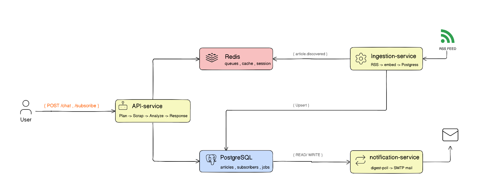
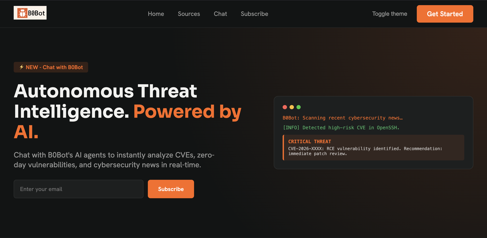
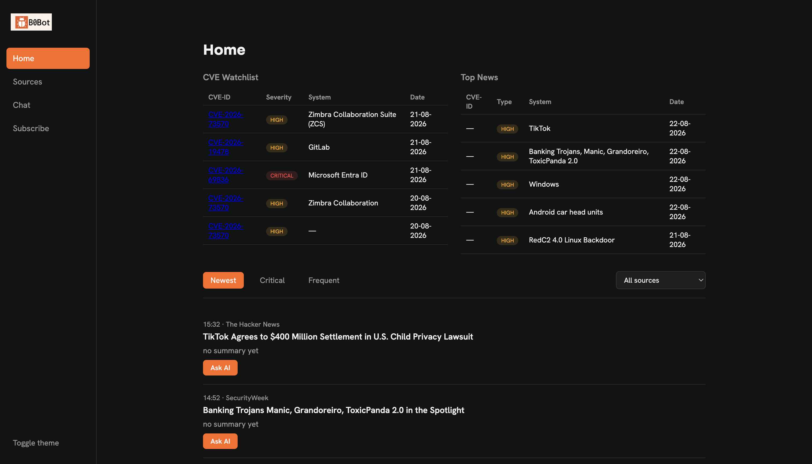
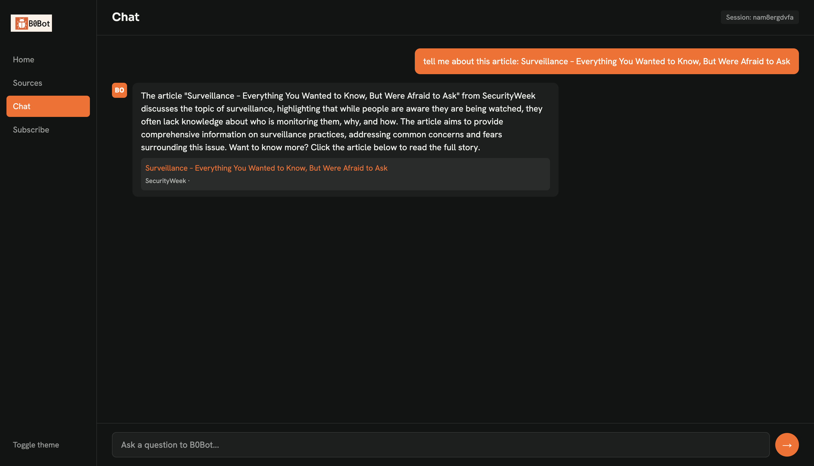
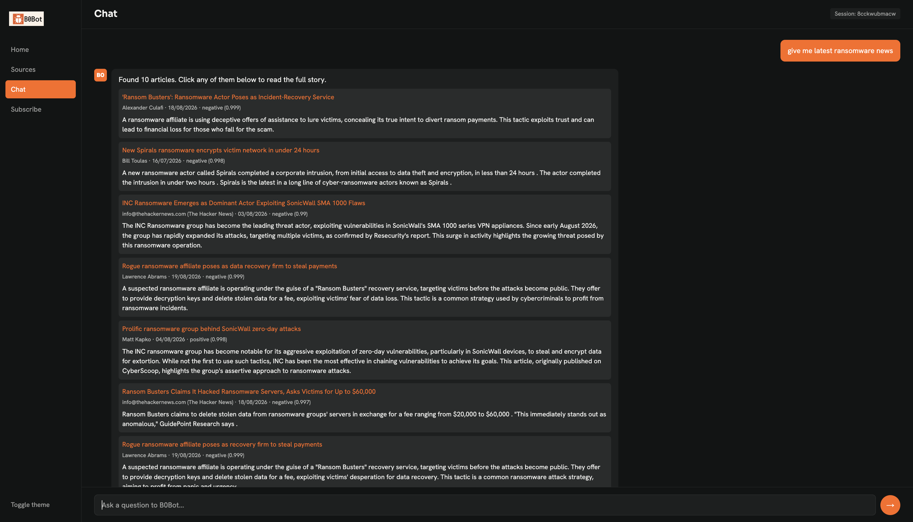
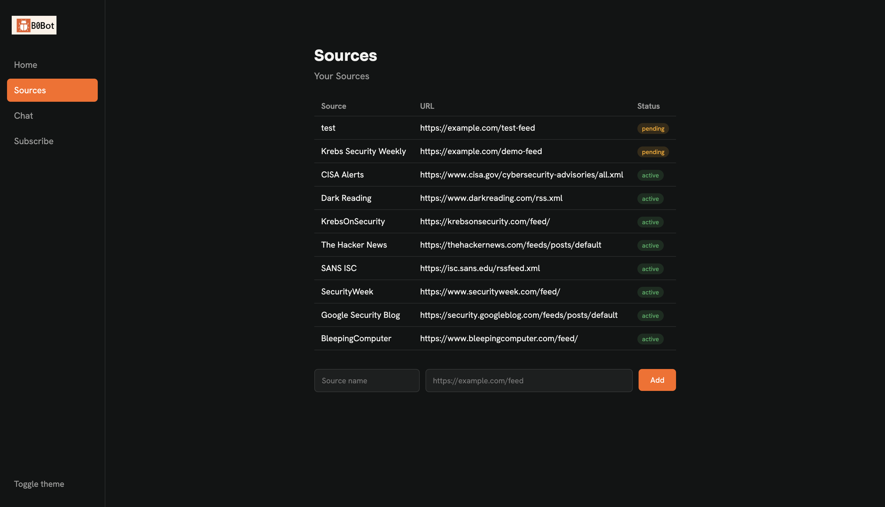

<h1 align="center">B0Bot - CyberSecurity News Intelligence Platform</h1>
<p align="center">
  <br/><br/>
  <a href="https://github.com/c2siorg/b0bot"></a>
  <a href="https://github.com/c2siorg/b0bot"></a>
  <a target="_blank" href="https://github.com/c2siorg/b0bot"></a>
  <a href="https://github.com/hywax/mafl/blob/main/LICENSE"></a>
  <br/><br/>
</p>
<p>
B0Bot is a cybersecurity news intelligence platform built around a three-service architecture: an ingestion service that polls RSS feeds and enriches articles with CVE/severity metadata, an api-service that runs a LangGraph agent pipeline for search, analysis, and a grounded Ask AI chat, and a notification service that sends digest emails to subscribers.
</p>

## Architecture



The project has three services, using PostgreSQL (with pgvector for embeddings) and Redis to share data and handle caching, sessions, and job queues:

- **ingestion-service** - polls RSS feeds loaded from the sources table (falls back to a hardcoded list if empty), extracts CVE/severity/affected-system metadata via LLM, computes embeddings, writes to Postgres
- **api-service** - Flask app serving the dashboard, chat, sources, and subscribe pages; runs every `/chat` request through a LangGraph agent pipeline
- **notification-service** - polls Postgres for subscribers due for a digest and sends via SMTP; subscriptions are created directly by api-service, no queue involved

All three run together via Docker Compose, alongside Postgres and Redis.

## Features

- **Dashboard** - CVE Watchlist, Top News, and a filterable article feed (Newest / Critical / Frequent, by source)
- **Ask AI** - click into any article to ask questions grounded in that specific article's content, powered by a hosted Cohere model
- **Hybrid search** - chat queries combine keyword relevance and vector similarity search over article embeddings
- **Sentiment & trend analysis** - per-article sentiment (DistilBERT) and keyword/trend surfacing across search results
- **Sources management** - view and add RSS sources feeding the ingestion pipeline
- **Subscribe / Unsubscribe** - email digests by interest tag and frequency (daily/weekly), manageable via chat or the subscribe form. Chat-based subscribe can span multiple turns - if the email or interests aren't in the message, it asks as a follow-up instead of failing silently

## Setup

1. Clone the repo and set up your environment file:

```bash
cp .env.example .env
```

Fill in the values - see [`.env.example`](.env.example) for what each one is for. At minimum you'll need a [HuggingFace token](https://huggingface.co/settings/tokens) - used for the local embedding/sentiment models, and to authenticate HuggingFace's InferenceClient, which is how the app reaches the hosted Cohere model for summaries, intent classification, and Ask AI.

2. Bring up the full stack with Docker Compose:

```bash
docker compose up -d
```

This starts Postgres (pgvector), Redis, and all three services. The api-service will be available at `http://localhost:5000`.

3. (Optional) Configure social connectors - see the [Social Connectors](#social-connectors) section below.

4. (Optional) Configure SMTP settings in `.env` if you want digest emails to actually send. Subscribing/unsubscribing itself doesn't depend on SMTP - that just updates the subscriber record. Without SMTP configured, the digest worker will fail to send and roll back that delivery attempt rather than crash, so it's safe to leave unset for local development.

## Social Connectors

**Layer 1 - RSS Feeds:** Pulls cybersecurity news from curated RSS feeds (KrebsOnSecurity, BleepingComputer, CISA, etc.) with no API key required.

**Layer 2 - Opt-in API Connectors:** Supports YouTube Data API v3 and NewsAPI.org for additional coverage. Both use free tiers and silently skip if keys are absent. See [`.env.example`](.env.example) for setup.

## LangGraph Agent Pipeline

Every `/chat` request runs through a LangGraph pipeline of agents, each reading and updating a shared state object:

1. **PlannerAgent** - classifies intent (search, analyze, subscribe, chitchat, or grounded) via a hosted LLM, with keyword-based fallback if the LLM call fails or is unavailable
2. **ScraperAgent** - runs hybrid search (keyword + vector similarity) against PostgreSQL/pgvector to find matching articles
3. **AnalyzerAgent** - computes keyword frequency, trending topics, and per-article sentiment (DistilBERT SST-2) across retrieved articles
4. **ResponderAgent** - checks Redis for a cached response first (5 minute TTL), otherwise builds and caches the JSON response. For `grounded` intent (Ask AI), calls out to Cohere with the specific article's content instead of running the full search pipeline
5. **NotificationAgent** - triggered on subscribe intent; extracts email, frequency, and interest tags from the conversation (can span multiple turns if info is missing), creates the subscriber

### Multi-turn Session Memory

Every `/chat` request accepts a `session_id`. Chat history for that session is stored in Redis with a 1 hour TTL and capped at 10 messages, so follow-up questions have context from previous turns. Ask AI grounding is single-turn only - it applies to the exact message sent right after clicking "Ask AI" on an article, not to later follow-ups in the same session.

## App Screenshots

**Landing page**


**Dashboard - CVE watchlist, top news, and article feed**


**Ask AI - grounded answers on a specific article**


**Search - hybrid search with sentiment per article**


**Sources - manage RSS feeds powering ingestion**


## Licensing

The MIT License 2023
